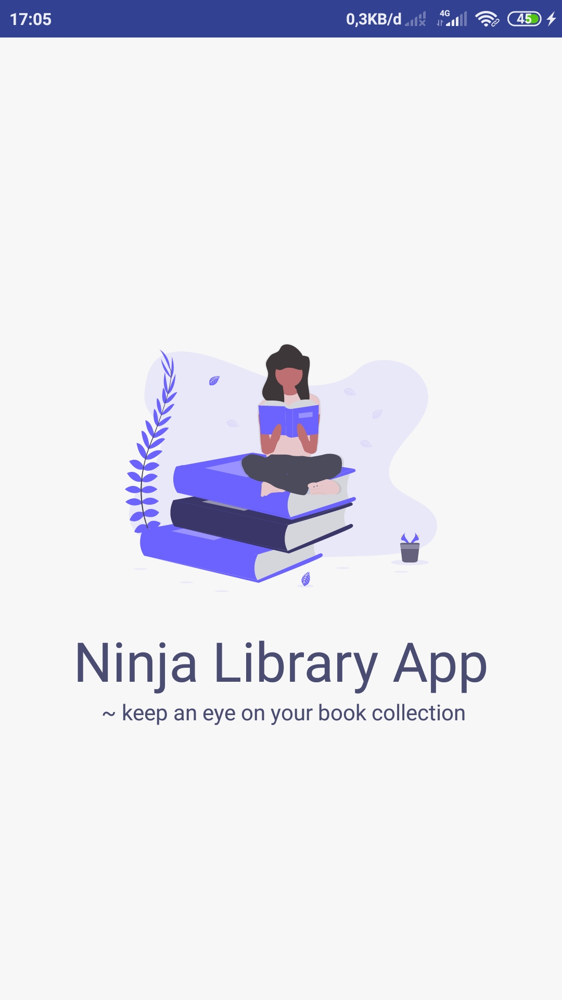
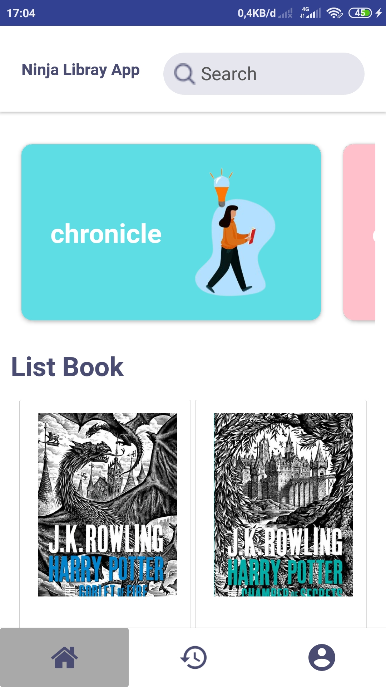
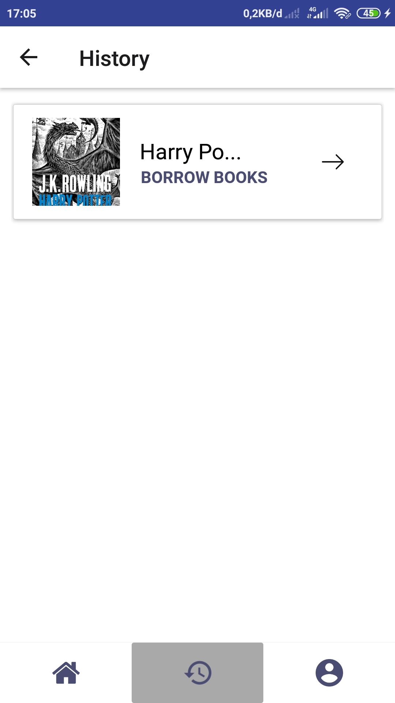
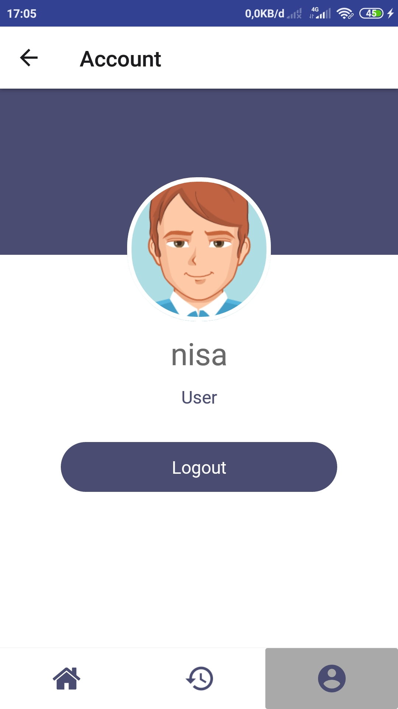

<h1 align="center">Ninja Library 📚</h1>

  

  Built with React Native.

## Table of Contents

- [Introduction](#introduction)
- [Features](#features)
- [Requirements](#requirements)
- [Usage](#usage-for-development)
- [Release APK](#release-apk)
- [Related Project](#related-project-backend)
- [Screenshots](#screenshots))

## Introduction
<b>Ninja Library</b> is a platform that provides various genre of books that can be borrowed and returned by readers

## Features

* Searching book
* Booking book
* History booking
* Show account

## Requirements
* [`npm`](https://www.npmjs.com/get-npm)
* [`react-native`](https://facebook.github.io/react-native/docs/getting-started)
* [`react-native-cli`](https://facebook.github.io/react-native/docs/getting-started)
* [`Backend-Ninja-Api`](https://github.com/regaaji/Ninja-Api)

## Usage for development
1. Open your terminal or command prompt
2. Type `git clone https://github.com/regaaji/RN-NInja-Library-Apps.git`
3. Open the folder and type `npm install` for install dependencies
4. Before run this, you must run backend first
5. Type `react-native run-android` for run this app. ***Make sure your device is connected with debugging mode***.

## Release APK

## Related Project (Backend)
* [`Backend-Ninja-Api`](https://github.com/regaaji/Ninja-Api)

## Screenshot App

<kbd>

</kbd>

<kbd>

</kbd>

<kbd>

</kbd>

<kbd>

</kbd>

<kbd>

</kbd>

<kbd>

</kbd>

<kbd>

</kbd>
