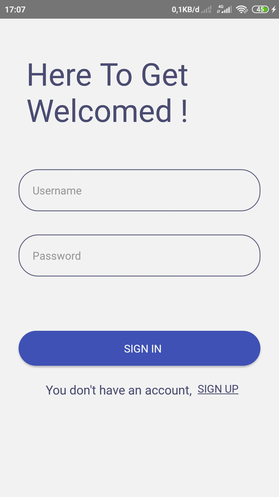

# React Native Ninja Library 📚


## Features

* Searching book
* Booking book
* History booking
* Show account

## Used Technology

* [React-Native](https://facebook.github.io/react-native/)
* [NativeBase](https://nativebase.io/)


## Running Locally

* Clone this Repository
* Run 
  ```sh 
  npm install 
  ``` 
  or  
  ```sh 
  yarn install 
  ```

## Screenshot App

<kbd>

</kbd>

<kbd>

</kbd>

<kbd>

</kbd>

<kbd>

</kbd>

<kbd>

</kbd>

<kbd>

</kbd>

<kbd>

</kbd>
